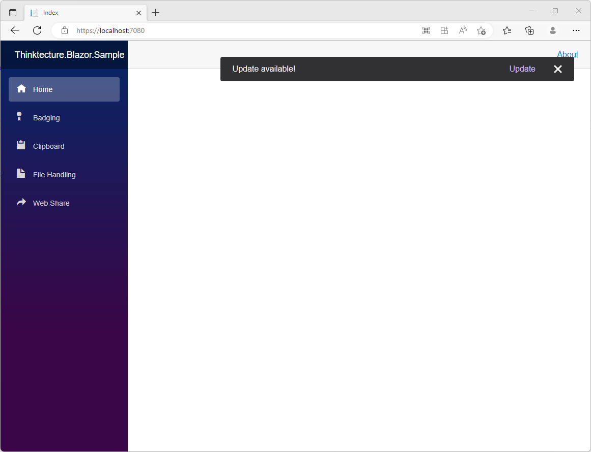

# Thinktecture.Blazor.PwaUpdate


[](https://www.nuget.org/packages/Thinktecture.Blazor.PwaUpdate/)

## Introduction

A Blazor wrapper for the [Service Worker Update](https://web.dev/service-worker-lifecycle/#update-on-reload).

The package allows subscribing to an event that fires as soon as a new update is available.

## Getting started

### Prerequisites

You need .NET 6.0 or newer to use this library.

[Download .NET 6](https://dotnet.microsoft.com/download/dotnet/7.0)

[Download .NET 7](https://dotnet.microsoft.com/download/dotnet/7.0)

### Platform support

[Platform support for Service Worker](https://caniuse.com/serviceworkers)

### Installation

You can install the package via NuGet with the Package Manager in your IDE or alternatively using the command line:

```
dotnet add package Thinktecture.Blazor.PwaUpdate
```

## Usage

The package can be used in Blazor WebAssembly projects.

### Add to service collection

To make the UpdateService available on all pages, register it at the IServiceCollection in `Program.cs` before the host is built:

```csharp
builder.Services.AddUpdateService();

```
### Add to Imports

To use the default UpdateModal component on the hole app razor files, register it in the `_Imports.razor` file.

```html
@using Thinktecture.Blazor.PwaUpdate
```

### Adapt Publish ServiceWorker

By default, service workers will only update when all tabs of the controlled websites have been closed.
To be able to update an application on reload, you need to call the `skipWaiting()` method of the service worker upon installation.
This skips the service worker's waiting phase, and the new version becomes active instantly.
A reload then leads to the new version of the application the be shown.
Please be aware of the potential implications this may have:
If the application relies on a certain version of the service worker or its cache while it is running, this may lead to errors during runtime.
If you want to opt into this behavior, add the following line to the published service worker file `service-worker.published.js`:

```diff
async function onInstall(event) {
    console.info('Service worker: Install');
+   self.skipWaiting();
    // … more code
}
```

### Update Modal

To use the default update modal, add the component to the main layout. For example:

```html
@inherits LayoutComponentBase

<UpdateModal InformationMessage="Update available!"></UpdateModal>

...

```
As soon as an update is available, a modal will appear in the upper right corner as shown in the example.



If you do not want to use the default layout, you can also pass a ChildContent, which will be displayed instead of the default. 

```html
<UpdateModal>
    <div>Update available!</div>
    <button onclick="@Reload">Update</button>
</UpdateModal>
```

Another option is to override CSS variables:
- The color of the close icon can be changed by this variable: `--close-icon-color`
    - The color must be an rgb valur like this: `255, 255, 255`
- The action button color can be changed by this variable: `--action-button-color`
    - The color must be an rgb valur like this: `208, 188, 255`
- The background color of the modal can be changed by this variable: `--modal-background`
- The text color of the modal can be changed by this variable: `--on-modal-background`

### Update Service

If you do not want to use the modal, you can also use only the update service. To do this, you can make the `IUpdateService` service available to the component, 
page, or service via dependency injection. To receive the event for an update, simply register for the `UpdateAvailable` event. 

Then call the initialization method `InitializeServiceWorkerUpdateAsync` to start the registration of the `StateChanged` event of the service worker.


```csharp
protected override async Task OnInitializedAsync()
{
    _updateService.UpdateAvailable = () => _newVersionAvailable = true;
    await _updateService.InitializeServiceWorkerUpdateAsync();
    ...
}
```


## Acknowledgements

Thanks to [Kristoffer Strube](https://twitter.com/kstrubeg) who provides [a Blazor wrapper for the File System Access API](https://github.com/KristofferStrube/Blazor.FileSystemAccess).
This library is inspired by Kristoffer's implementation and project setup.

## License and Note

BSD-3-Clause.

This is a technical showcase, not an official Thinktecture product.
